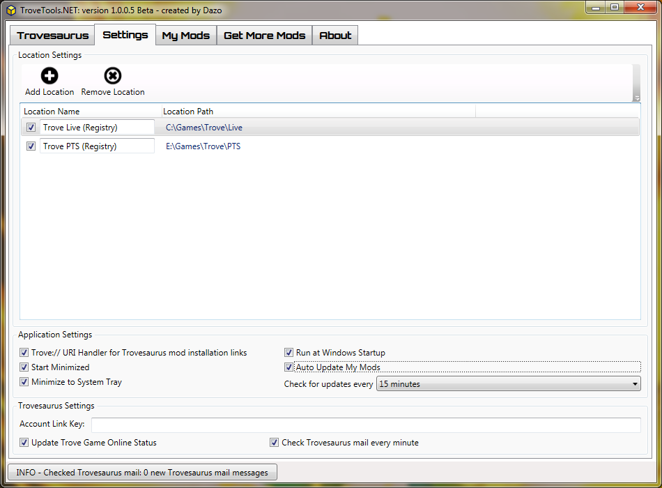
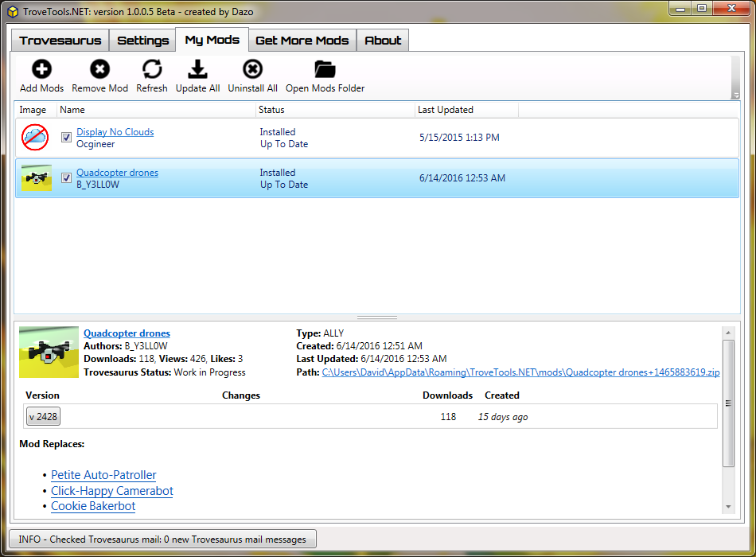
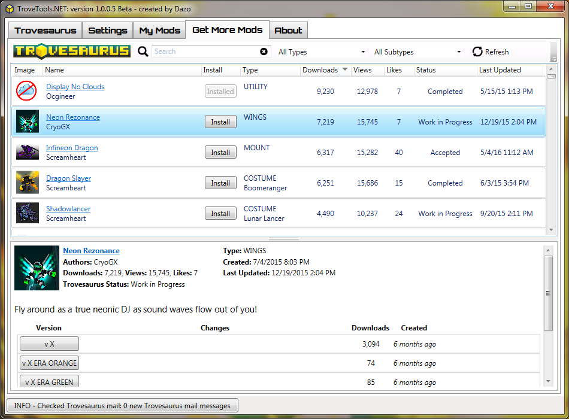

# TroveTools.NET
TroveTools.NET allows easy installation of Trove modifications by searching and downloading from the Trovesaurus mod repository. This application creates the necessary override folders such that the files are not removed by the Glyph client when updating Trove.

[Download the ClickOnce installer here](https://github.com/DazoTrove/TroveTools.NET/raw/master/TroveTools.NET/publish/setup.exe)

[Report issues or request features here](https://github.com/DazoTrove/TroveTools.NET/issues)

## Troubleshooting

### Cannot Start Application error
If you receive the error message "Application cannot be started. Contact the Application vendor" this is a Microsoft ClickOnce deployment error message and the following steps may help fix the issue. Try to launch the application after each step to see whether the issue is resolved:

1. Clear the ClickOnce application cache
  * First try running the following command (*Start - Run...*): `rundll32 dfshim CleanOnlineAppCache`
  * If you still are having issues, try opening the folder: `%LocalAppData%\Apps\2.0` and then delete all of the subfolders there
2. Uninstall the application from *Control Panel - Programs and Features*, and reinstall the application using the [latest setup application](https://github.com/DazoTrove/TroveTools.NET/raw/master/TroveTools.NET/publish/setup.exe).
3. Check whether your antivirus software is quarantining any files during the download process. If it is try excluding the files.

ClickOnce troubleshooting references:
* [MSDN Forum Post: Activation failed - The system cannot find the file specified error](https://social.msdn.microsoft.com/Forums/windows/en-US/aef681af-d560-4085-9101-eb4573e02028/activation-failed-the-system-cannot-find-the-file-specified-error?forum=winformssetup)
* [MSDN Forum Post: ClickOnce Deployment "Application cannot start" error after latest publish](https://social.msdn.microsoft.com/Forums/windows/en-US/804a5ce6-7d22-4f10-8ae6-d75cf2766359/clickonce-deployment-application-cannot-start-error-after-latest-publish?forum=winformssetup)

## Screenshots

